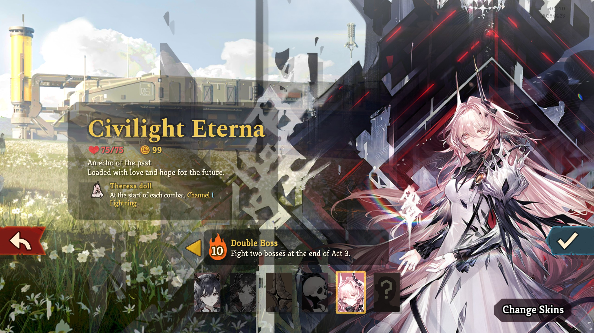
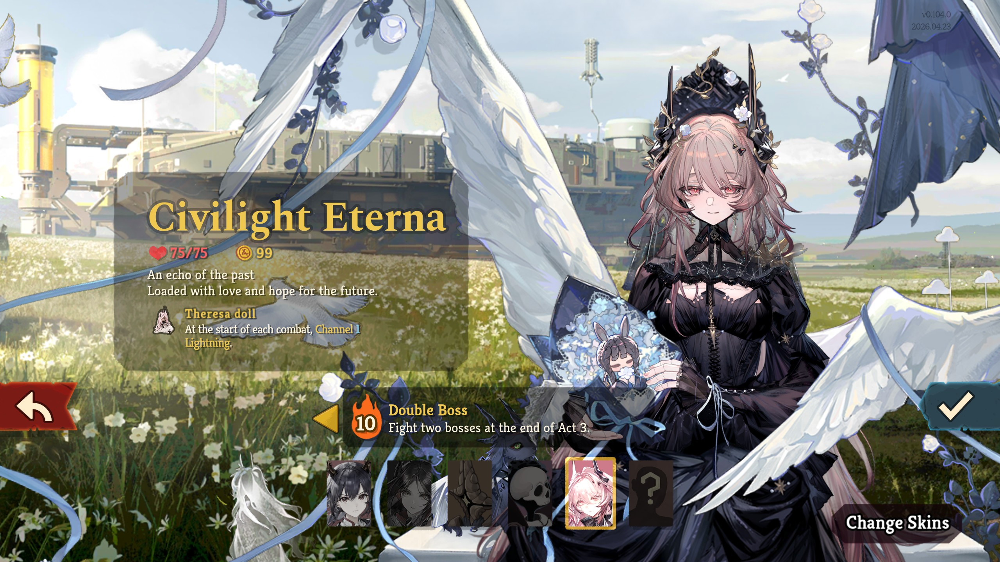
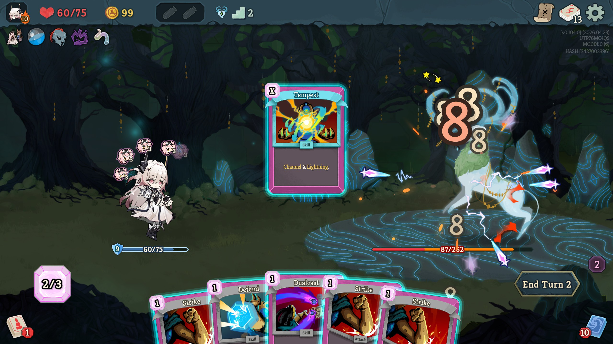
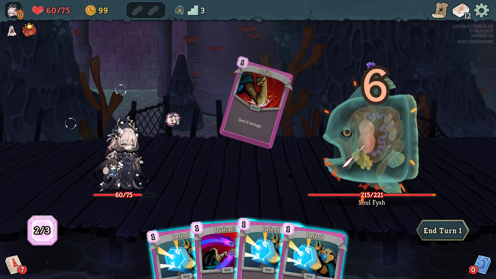
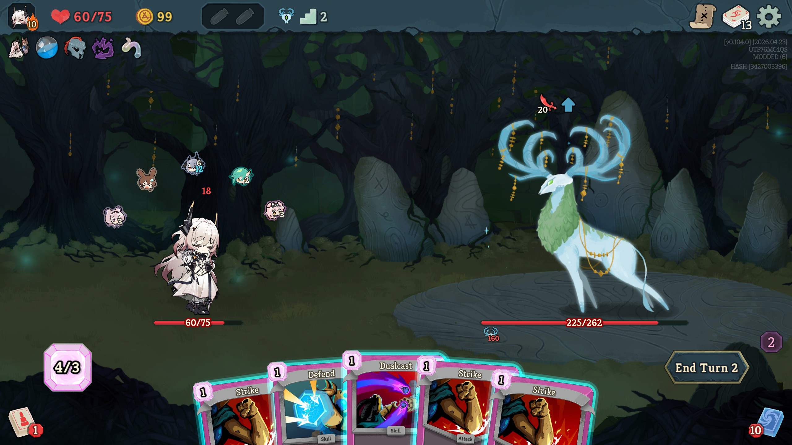
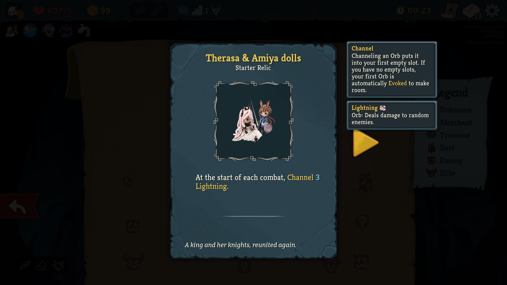

# Civilight Eterna Defect
 Civilight Eterna from Arknights As The Defect
 > Keep striding forward. I shall be at your side.

 ## Installation
Please install through [Steam Workshop](https://steamcommunity.com/id/thunninoi-yours-truly/myworkshopfiles?appid=2868840)

 ## Compatibilites
 This mod should be compatible with any mods that doesn't replace character's assets such as another skin mods etc.

 ## Disclaimer
 Most of the assets are property of **Hypergryph** and are taken from **Arknights**. I do not claim any rights to any of assets used in this repository. This project is strictly fan-made and non-commercial.

 ## Screenshots

### Me yapping
Totally unbiased character for arguably the best character in Slay The Spire2 , trust me.

I did severely underestimate how much time this would take, turn out having to source out orb sprite and adding custom animation into the game was not as straightforward as I hoped. This mod code is a total mess that I couln't fathom fixing them if they gone wrong. Also during development BaseLib did have a lot of changes which kind of messed up my code a little bit. That's the catch for making a game where modding resource is still developing and early access game i gues.